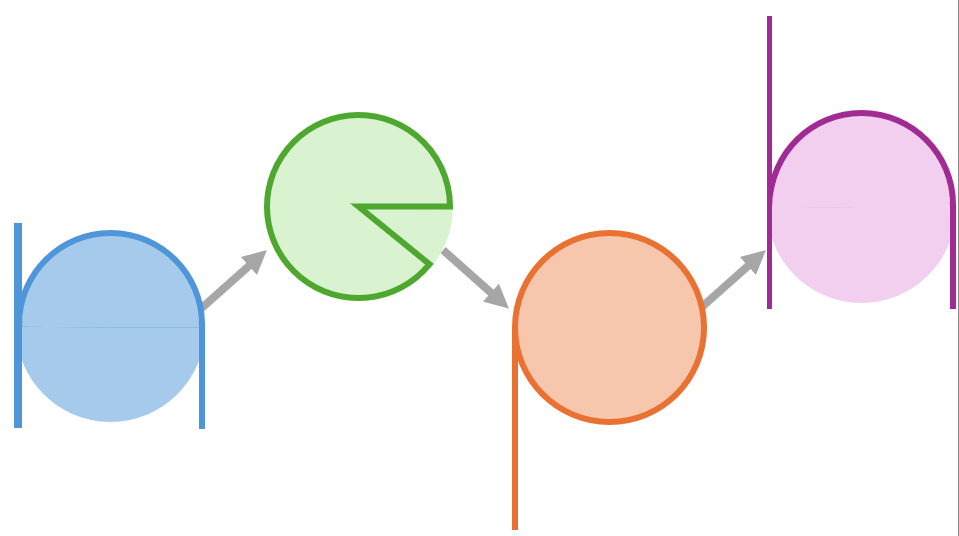

# Neph

AWS attack path graphing tool.

A quick start guide can be found here: [Quickstart](docs/Quickstart.md).

The release blog can be found here: https://sra.io/blog/pruning-garden-paths-in-aws-with-neph/
